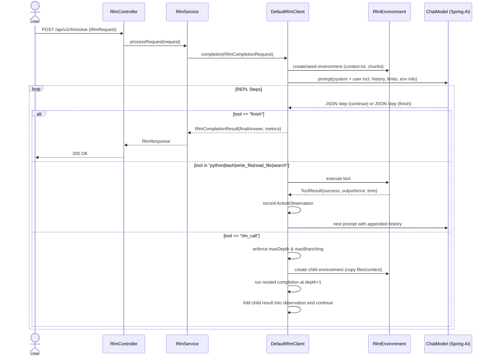

# RLM System Documentation

This document describes the current architecture, components, configuration, and request flow of the Spring AI RLM (Recursive Language Model) microservice.

Important: The system currently uses a REPL-style orchestrator implemented in DefaultRlmClient that iteratively prompts a model for the next tool action. Some legacy classes (e.g., RecursionStrategy and RecursiveThinkingService) remain in the codebase but are not used in the active execution path described below.

## 1. Overview

The service solves complex problems by:
- Maintaining a per-request execution environment (working directory with context and files)
- Iteratively asking the LLM to return a next action in strict JSON form: which tool to run and with what code/command
- Executing that action (python, bash, write_file, read_file, search, or a recursive rlm_call)
- Feeding observations back to the model and repeating until the model signals finish
- Supporting recursive sub-queries via rlm_call in child environments with inherited state

## 2. Core Components

- RlmController (com.oracle.rlm.controller.RlmController)
  - REST endpoints:
    - POST /api/v1/rlm/solve (application/json)
    - POST /api/v1/rlm/solve (multipart/form-data) — allows uploading a context file; form fields: problem, maxDepth, maxBranching, strategy, verbose, context=@file
    - GET /api/v1/rlm/health
  - Handles validation and error wrapping for responses.

- RlmService (com.oracle.rlm.service.RlmService)
  - Maps API request (RlmRequest) to core request (RlmCompletionRequest), defaulting unspecified values from RlmConfig.
  - Calls RlmClient.completion and maps RlmCompletionResult to RlmResponse.

- DefaultRlmClient (com.oracle.rlm.core.impl.DefaultRlmClient)
  - Orchestrates the REPL loop with the model:
    - Lazily builds a ChatClient from ChatClient.Builder with system prompt from RlmPromptService.
    - Creates or reuses an RlmEnvironment (per request).
    - Seeds inline context (context.txt handling).
    - Iteratively:
      - Builds a user prompt embedding task, recursion limits, environment info, and prior step history.
      - Calls the model and parses a strict JSON step.
      - Executes the chosen tool in the environment.
      - Records ActionObservation and continues until finish or max steps.
  - Recursion via rlm_call:
    - Creates a child environment, copies files and context, and invokes a nested runCompletion at deeper depth.
    - Enforces maxDepth and per-depth maxBranching.
  - Handles non-JSON model outputs using robust fallbacks (e.g., extracting code from fenced blocks) to maintain progress.

- RlmPromptService (com.oracle.rlm.service.RlmPromptService)
  - Provides:
    - System prompt: explains tool set, strict JSON schema, and rlm_call usage.
    - User prompt: includes task, recursion parameters, environment info, and a compact history of previous actions/observations.

- RlmEnvironment and ExecutableRlmEnvironment (com.oracle.rlm.core.RlmEnvironment; com.oracle.rlm.core.impl.ExecutableRlmEnvironment)
  - Provides a dedicated working directory per environment, with:
    - Context file: context.txt
    - Tool execution:
      - python: writes a .py file and runs it with a 30s timeout. A Python prelude injects CONTEXT and a helper to schedule rlm_call by writing rlm_tool_request.json.
      - bash: executes shell commands with timeout.
      - write_file/read_file: manage files inside the working directory.
      - search: simple text search over context and stored chunks.
    - Tracks ActionObservation history and exposes environment metadata.

- OpenAIConfig (com.oracle.rlm.config.OpenAIConfig)
  - Supplies a single ChatClient.Builder by picking the first available ChatModel:
    - Preference order: OpenAI > Anthropic > Google
  - If none are available, fails fast with a clear error.

- RlmConfig (com.oracle.rlm.config.RlmConfig) and RlmSecurityConfig (com.oracle.rlm.config.RlmSecurityConfig)
  - RLM configuration defaults and security constraints (e.g., allowed commands, time limits).

## 3. Sequence Diagram



Python bridge for rlm_call inside python code:
- ExecutableRlmEnvironment prelude defines rlm_call(sub_query) that writes rlm_tool_request.json.
- After python completes, DefaultRlmClient checks for that file and converts it into an actual rlm_call tool execution.

## 4. Data Models

- RlmRequest (API)
  - problem: string (required, non-blank)
  - maxDepth: int (default 3; 1..5)
  - maxBranching: int (default 3; 1..5)
  - strategy: string (default "depth-first" or "breadth-first") — currently advisory; the active orchestrator uses REPL with rlm_call controls.
  - verbose: boolean (default false) — if true, returns detailed thought processes
  - context: string (optional)

- RlmResponse (API)
  - problem
  - finalAnswer
  - thoughtProcesses (list; present when verbose=true)
  - totalSteps
  - maxDepthReached
  - processingTimeMs
  - timestamp
  - strategy

## 5. Tools and Execution

Supported tools (enforced by system prompt and DefaultRlmClient):
- python: Execute Python code in the environment
  - Prelude injects:
    - CONTEXT variable (context.txt contents)
    - rlm_call helper that schedules a sub-query
  - 30s default timeout
- bash: Execute shell command (30s timeout)
- write_file: Two strict formats are accepted in the step JSON "code" field:
  - "FILENAME\nCONTENT"
  - write_file("FILENAME", "CONTENT")
- read_file: Two strict formats:
  - "FILENAME"
  - read_file("FILENAME")
- search: Simple text search in the environment and context/chunks
- rlm_call: Triggers a recursive sub-query at deeper depth in a child environment
- finish: Signals completion with the final answer

Security:
- See RlmSecurityConfig for allowed commands (defaults include python3, bash), file size, and execution time caps.

## 6. Configuration

application.properties contains defaults. Key groups:

- Server
  - server.port=8080

- Cache
  - spring.cache.type=caffeine
  - spring.cache.caffeine.spec=maximumSize=100,expireAfterWrite=3600s

- Logging
  - logging.level.org.springframework.ai=INFO
  - logging.pattern.console=%d{yyyy-MM-dd HH:mm:ss} - %msg%n

- RLM Core (RlmConfig)
  - rlm.max-depth (default 3; note properties file may contain multiple entries; last one wins)
  - rlm.max-branching=3
  - rlm.timeout-seconds=30
  - rlm.enable-caching=true
  - rlm.decomposition-temperature=0.8
  - rlm.solving-temperature=0.7
  - rlm.aggregation-temperature=0.6
  - rlm.execution-timeout-seconds=30 (additional cap used by environment/tools)

- Security (RlmSecurityConfig)
  - rlm.security.allow-network=false
  - rlm.security.allow-file-system=true
  - rlm.security.max-file-size-mb=10
  - rlm.security.allowed-commands[0]=python3
  - rlm.security.allowed-commands[1]=bash

- Model Providers (Spring AI)
  - Provider toggles:
    - spring.ai.openai.enabled=[true|false]
    - spring.ai.anthropic.enabled=[true|false] (true in repo defaults)
    - spring.ai.google.genai.enabled=[true|false]
  - API keys:
    - OpenAI: spring.ai.openai.api-key or OPENAI_API_KEY
    - Anthropic: spring.ai.anthropic.api-key or ANTHROPIC_API_KEY
    - Google: spring.ai.google.genai.api-key or GEMINI_API_KEY
  - Example model defaults in repo:
    - Anthropic: claude-3-haiku-20240307 (enabled=true by default)
    - OpenAI: gpt-4.1-nano-2025-04-14 (enabled=false by default)
    - Google: gemini-2.5-flash (enabled=false by default)

ChatModel selection: OpenAI > Anthropic > Google (first available bean wins). If none configured, startup fails with a clear error.

## 7. API Details

Base path: /api/v1/rlm

- POST /solve (application/json)
  - Body is RlmRequest
- POST /solve (multipart/form-data)
  - Fields: problem, maxDepth?, maxBranching?, strategy?, verbose?, context? (file)
  - The controller manually builds RlmRequest to avoid binding issues
  - Returns 400 on missing/blank problem in multipart
- GET /health

Example requests:

JSON:
```bash
curl -X POST http://localhost:8080/api/v1/rlm/solve \
  -H "Content-Type: application/json" \
  -d '{
    "problem": "Calculate the sum of all prime numbers between 1 and 100",
    "maxDepth": 3,
    "maxBranching": 3,
    "strategy": "depth-first",
    "verbose": true
  }'
```

Multipart with context file:
```bash
curl -X POST http://localhost:8080/api/v1/rlm/solve \
  -H "Accept: application/json" \
  -F "problem=Summarize this document and propose next steps" \
  -F "maxDepth=3" \
  -F "maxBranching=3" \
  -F "strategy=depth-first" \
  -F "verbose=true" \
  -F "context=@./my-context.txt;type=text/plain"
```

## 8. Execution Environment Details

- Working directory: unique per environment, created at runtime (e.g., rlm_env_<uuid>)
- Context file: context.txt
  - Also injected into Python as CONTEXT
- File ops are sandboxed to the environment directory
- Python prelude:
  - Defines rlm_call(sub_query) to write rlm_tool_request.json
  - After python completion, the client consumes this JSON and performs the rlm_call

## 9. Error Handling and Limits

- Validation: RlmRequest enforces bounds (maxDepth and maxBranching in 1..5; problem non-blank)
- Execution timeouts: 30s default for tools in the environment; overall request time reflected in processingTimeMs
- Max steps safety: proportional to depth (MaxSteps ≈ maxDepth*10)
- Errors surface as:
  - HTTP 400 for invalid multipart problem
  - HTTP 500 otherwise (controller wraps exceptions with message body)
- Non-JSON model responses are handled with fallbacks; logs include abbreviated snippets to avoid noise.

## 10. Extensibility

- Adding tools: extend RlmEnvironment and map new tool names in DefaultRlmClient.executeTool
- Custom prompts: tweak RlmPromptService system/user prompts to change behavior or schema
- Providers: enable one model provider and configure its key and options; OpenAI > Anthropic > Google precedence
- Security: adjust RlmSecurityConfig and properties to fit deployment constraints

## 11. Legacy Strategy Components (Non-Active Path)

Classes under com.oracle.rlm.strategy and com.oracle.rlm.service.RecursiveThinkingService model a classical strategy-driven recursive decomposition (DepthFirstRecursion, BreadthFirstRecursion). They are not currently invoked by DefaultRlmClient’s REPL execution path. They remain for reference and potential future alternate implementations.
