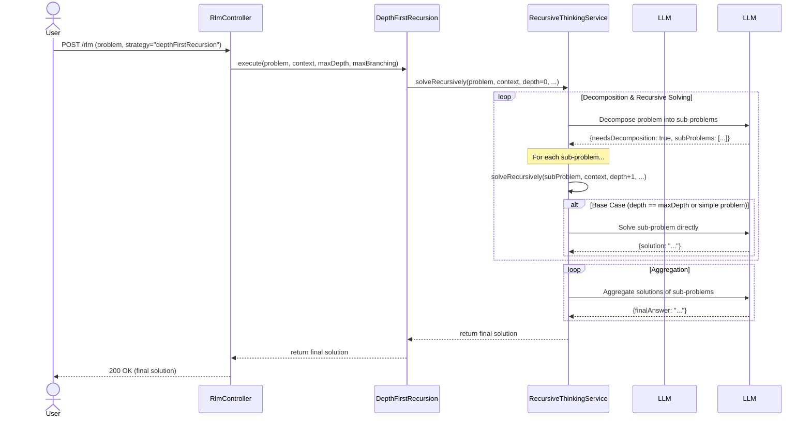

# Documentation for `DepthFirstRecursion.java`

This document provides a detailed explanation of the `DepthFirstRecursion` class, its role within the Recursive Language Model (RLM) framework, and how it orchestrates a depth-first traversal of a problem space.

## I. Overview

The `DepthFirstRecursion` class is a core component of the RLM system, designed to solve complex problems by breaking them down into smaller, manageable sub-problems and then synthesizing their solutions. It implements the `RecursionStrategy` interface, providing a specific, depth-first approach to the recursive problem-solving process.

This strategy is analogous to a depth-first search (DFS) algorithm on a tree. The "tree" in this context is the hierarchy of a problem and its sub-problems. The `DepthFirstRecursion` strategy explores as far as possible down each branch (sub-problem) before backtracking.

## II. System Diagram

The following diagram illustrates the sequence of operations when the `DepthFirstRecursion` strategy is executed.


```mermaid
sequenceDiagram
    actor User
    participant RlmController
    participant DepthFirstRecursion
    participant RecursiveThinkingService
    participant LargeLanguageModel as LLM

    User->>RlmController: POST /rlm (problem, strategy="depthFirstRecursion")
    RlmController->>DepthFirstRecursion: execute(problem, context, maxDepth, maxBranching)
    DepthFirstRecursion->>RecursiveThinkingService: solveRecursively(problem, context, depth=0, ...)
    
    loop Decomposition & Recursive Solving
        RecursiveThinkingService->>LLM: Decompose problem into sub-problems
        LLM-->>RecursiveThinkingService: {needsDecomposition: true, subProblems: [...]}
        
        Note over RecursiveThinkingService: For each sub-problem...
        RecursiveThinkingService->>RecursiveThinkingService: solveRecursively(subProblem, context, depth+1, ...)
        
        alt Base Case (depth == maxDepth or simple problem)
            RecursiveThinkingService->>LLM: Solve sub-problem directly
            LLM-->>RecursiveThinkingService: {solution: "..."}
        end
    end
    
    loop Aggregation
        RecursiveThinkingService->>LLM: Aggregate solutions of sub-problems
        LLM-->>RecursiveThinkingService: {finalAnswer: "..."}
    end

    RecursiveThinkingService-->>DepthFirstRecursion: return final solution
    DepthFirstRecursion-->>RlmController: return final solution
    RlmController-->>User: 200 OK (final solution)
```

## III. Class Definition and Functionality

### `com.oracle.rlm.strategy.DepthFirstRecursion.java`

```java
package com.oracle.rlm.strategy;

import com.oracle.rlm.model.RecursionStep;
import com.oracle.rlm.service.RecursiveThinkingService;
import lombok.RequiredArgsConstructor;
import org.springframework.stereotype.Component;

@Component("depthFirstRecursion")
@RequiredArgsConstructor
public class DepthFirstRecursion implements RecursionStrategy {
    
    private final RecursiveThinkingService recursiveThinkingService;
    
    @Override
    public RecursionStep execute(String problem, String context, int maxDepth, int maxBranching) {
        // Depth-first naturally follows the recursive approach
        return recursiveThinkingService.solveRecursively(problem, context, 0, maxDepth, maxBranching, null);
    }
}
```

### A. Annotations

-   `@Component("depthFirstRecursion")`: This annotation registers the class as a Spring component, making it available for dependency injection. The string `"depthFirstRecursion"` provides a unique identifier for this specific implementation of `RecursionStrategy`, allowing it to be selected at runtime (e.g., via a controller).
-   `@RequiredArgsConstructor`: A Lombok annotation that generates a constructor with all final fields as arguments. In this case, it creates a constructor to inject the `RecursiveThinkingService`.

### B. Interface Implementation

`DepthFirstRecursion` implements the `RecursionStrategy` interface, which mandates the implementation of the `execute` method. This adherence to a common interface allows for different recursion strategies (like breadth-first) to be developed and used interchangeably.

### C. Dependencies

-   `RecursiveThinkingService`: This is the engine of the RLM system. `DepthFirstRecursion` delegates the entire problem-solving process to this service. The `solveRecursively` method within this service is designed in a way that naturally performs a depth-first traversal.

## IV. Method: `execute`

This is the primary method of the class and the entry point for the strategy.

```java
@Override
public RecursionStep execute(String problem, String context, int maxDepth, int maxBranching) {
    return recursiveThinkingService.solveRecursively(problem, context, 0, maxDepth, maxBranching, null);
}
```

### A. Parameters

-   `problem` (String): The complex problem statement that needs to be solved.
-   `context` (String): Any additional context or information that might be useful for solving the problem.
-   `maxDepth` (int): The maximum number of recursive steps. This prevents infinite recursion and controls how deeply the problem can be decomposed.
-   `maxBranching` (int): The maximum number of sub-problems to generate at each decomposition step.

### B. Logic

The `execute` method's logic is straightforward:

1.  It receives the problem and configuration parameters from its caller (typically a controller).
2.  It immediately calls `recursiveThinkingService.solveRecursively`, passing along all the parameters.
3.  It initializes the `currentDepth` to `0` and the `parentStepId` to `null`, as this is the root of the problem-solving tree.
4.  It returns the `RecursionStep` object, which contains the complete, structured solution, including all sub-steps and reasoning.

The comment, "Depth-first naturally follows the recursive approach," is key. The `solveRecursively` method in `RecursiveThinkingService` is a classic recursive function. It processes one sub-problem completely by calling itself, going deeper and deeper until a base case is hit, before it moves to the next sub-problem at the same level. This inherent behavior of the call stack in a recursive function results in a depth-first traversal of the problem space.
