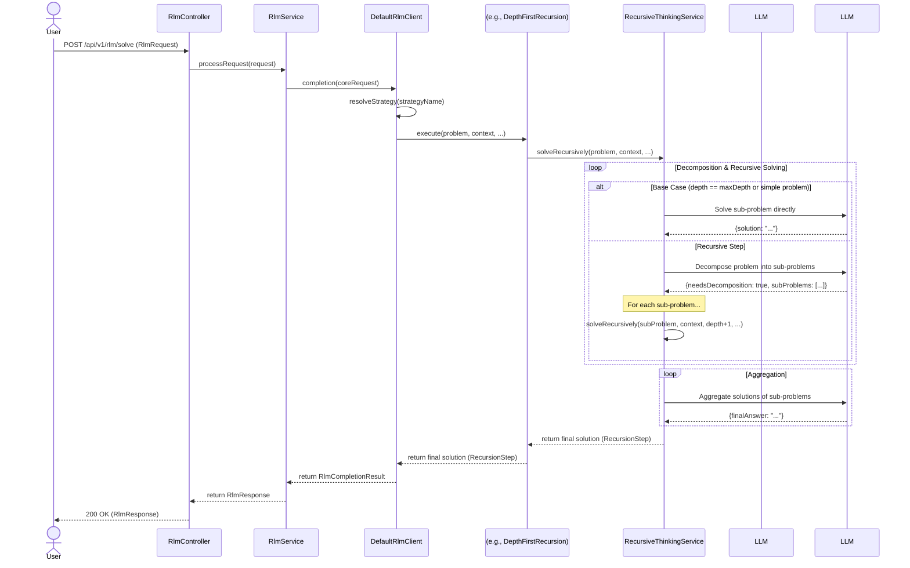

# RLM System Documentation

This document provides a detailed explanation of the Recursive Language Model (RLM) system architecture, its core components, and the flow of a problem-solving request.

## I. System Architecture Overview

The RLM system is designed to solve complex problems by recursively breaking them down into smaller, manageable sub-problems and then synthesizing their solutions. The architecture is layered to separate concerns, with a clear flow from request handling to core recursive logic.

The main components are:
-   **`RlmController`**: The API endpoint that receives user requests.
-   **`RlmService`**: A service layer that prepares the request for the core client.
-   **`RlmClient`**: The central orchestrator that manages the problem-solving process.
-   **`RecursionStrategy`**: A strategy pattern implementation for different traversal methods (e.g., depth-first, breadth-first).
-   **`RecursiveThinkingService`**: The core engine that implements the recursive decomposition and synthesis logic, interacting with the Large Language Model (LLM).

## II. System Sequence Diagram

The following diagram illustrates the sequence of operations for a typical problem-solving request.

```mermaid
sequenceDiagram
    actor User
    participant RlmController
    participant RlmService
    participant RlmClient as DefaultRlmClient
    participant RecursionStrategy as (e.g., DepthFirstRecursion)
    participant RecursiveThinkingService
    participant LargeLanguageModel as LLM

    User->>RlmController: POST /api/v1/rlm/solve (RlmRequest)
    RlmController->>RlmService: processRequest(request)
    RlmService->>RlmClient: completion(coreRequest)
    
    RlmClient->>RlmClient: resolveStrategy(strategyName)
    RlmClient->>RecursionStrategy: execute(problem, context, ...)
    
    RecursionStrategy->>RecursiveThinkingService: solveRecursively(problem, context, ...)
    
    loop Decomposition & Recursive Solving
        alt Base Case (depth == maxDepth or simple problem)
            RecursiveThinkingService->>LLM: Solve sub-problem directly
            LLM-->>RecursiveThinkingService: {solution: "..."}
        else Recursive Step
            RecursiveThinkingService->>LLM: Decompose problem into sub-problems
            LLM-->>RecursiveThinkingService: {needsDecomposition: true, subProblems: [...]}
            
            Note over RecursiveThinkingService: For each sub-problem...
            RecursiveThinkingService->>RecursiveThinkingService: solveRecursively(subProblem, context, depth+1, ...)
        end
    end
    
    loop Aggregation
        RecursiveThinkingService->>LLM: Aggregate solutions of sub-problems
        LLM-->>RecursiveThinkingService: {finalAnswer: "..."}
    end

    RecursiveThinkingService-->>RecursionStrategy: return final solution (RecursionStep)
    RecursionStrategy-->>RlmClient: return final solution (RecursionStep)
    RlmClient-->>RlmService: return RlmCompletionResult
    RlmService-->>RlmController: return RlmResponse
    RlmController-->>User: 200 OK (RlmResponse)
```

## III. Component Breakdown

### 1. `RlmController`
-   **File:** `com.oracle.rlm.controller.RlmController.java`
-   **Role:** Acts as the entry point for all API requests.
-   **Functionality:** It defines the `/api/v1/rlm/solve` endpoint, deserializes the incoming JSON request into an `RlmRequest` object, and passes it to the `RlmService`. It is responsible for handling HTTP-level concerns and basic error handling.

### 2. `RlmService`
-   **File:** `com.oracle.rlm.service.RlmService.java`
-   **Role:** Acts as a bridge between the controller and the core `RlmClient`.
-   **Functionality:** It takes the `RlmRequest`, applies default configuration values (e.g., `maxDepth`), and transforms it into a `RlmCompletionRequest` suitable for the core client. This decouples the API model from the core domain model.

### 3. `RlmClient` (`DefaultRlmClient`)
-   **File:** `com.oracle.rlm.core.impl.DefaultRlmClient.java`
-   **Role:** The central orchestrator of the problem-solving process.
-   **Functionality:**
    -   **Strategy Selection:** It resolves the requested `RecursionStrategy` (e.g., "depth-first") from a map of available strategy beans.
    -   **Context Building:** It constructs the full context for the problem, combining any inline context from the request with data from the `RlmEnvironmentStore`.
    -   **Execution:** It invokes the `execute` method of the selected strategy.
    -   **Result Processing:** It takes the final `RecursionStep` returned by the strategy and transforms it into a `RlmCompletionResult`, extracting metrics like processing time, total steps, and thought processes.

### 4. `RecursionStrategy` (e.g., `DepthFirstRecursion`)
-   **File:** `com.oracle.rlm.strategy.DepthFirstRecursion.java`
-   **Role:** Implements a specific method for traversing the problem-solving tree.
-   **Functionality:** The `execute` method serves as the entry point for the recursive process. It immediately delegates the call to the `RecursiveThinkingService.solveRecursively` method. The choice of strategy primarily determines how the recursive calls will be structured in the future (e.g., sequentially for depth-first, or in parallel for a potential breadth-first implementation).

### 5. `RecursiveThinkingService`
-   **File:** `com.oracle.rlm.service.RecursiveThinkingService.java`
-   **Role:** The engine of the RLM system, containing the core recursive logic.
-   **Functionality:**
    -   **Base Case:** Determines if a problem should be solved directly (if `currentDepth` reaches `maxDepth` or the problem is simple).
    -   **Decomposition:** If not a base case, it calls the LLM with a "decompose" prompt to break the problem into smaller sub-problems.
    -   **Recursion:** It calls itself for each sub-problem, incrementing the depth. This self-invocation naturally creates a depth-first traversal.
    -   **Synthesis:** After the sub-problems are solved, it calls the LLM with an "aggregate" prompt to synthesize the individual solutions into a final answer for the parent problem.
    -   **LLM Interaction:** Manages all communication with the Large Language Model, using prompts from the `PromptTemplateService`.